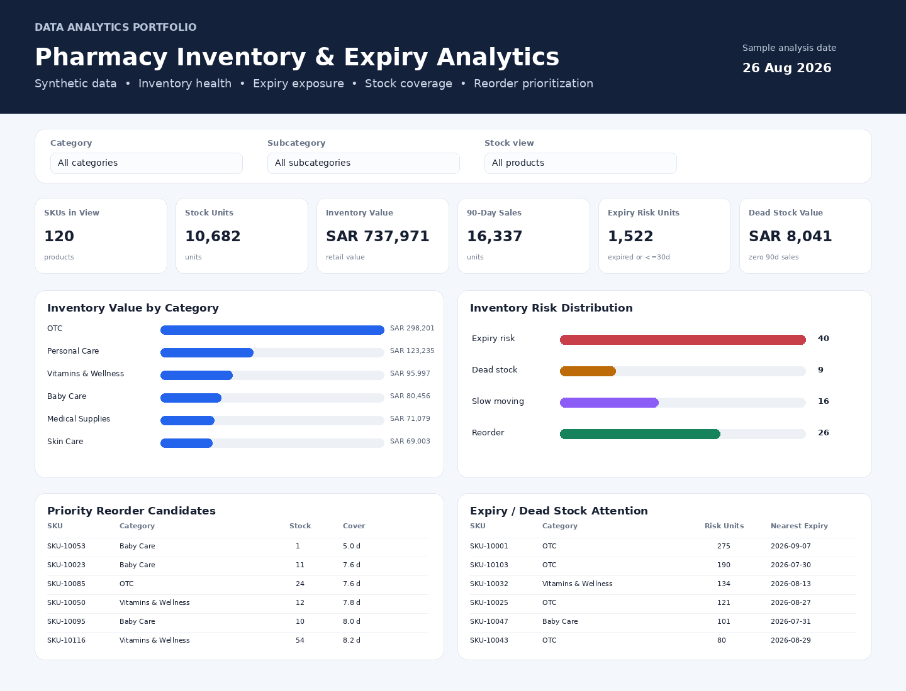
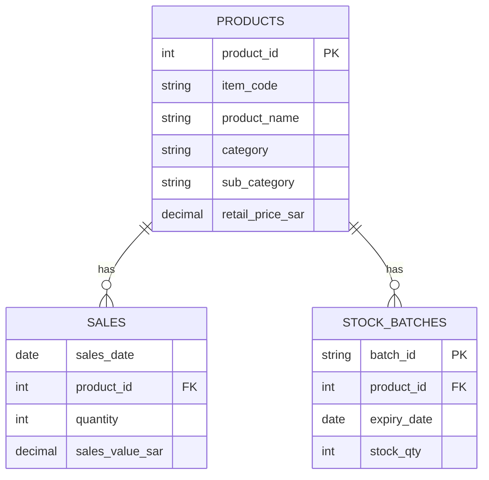

# Pharmacy Inventory & Expiry Analytics

A recruiter-friendly **Data Analyst / Business Analyst portfolio project** that demonstrates how recent sales, product master data, stock-on-hand, and batch expiry dates can be combined to support pharmacy inventory decisions.

> **Privacy statement:** this repository contains **synthetic sample data only**. It does not contain real company, customer, employee, prescription, National ID, credential, API, connection-string, server, or proprietary operational data.



## Featured Portfolio

**Khaled Zidan — Healthcare & Business Data Analytics**

[Saudi Healthcare Analytics](https://github.com/khaledzidan203-stack/saudi-healthcare-analytics) ·
[Hospital360](https://github.com/khaledzidan203-stack/Hospital360) ·
[Online Retail Growth & Customer Intelligence](https://github.com/khaledzidan203-stack/online-retail-growth-customer-intelligence) ·
[Pharmacy Category Management](https://github.com/khaledzidan203-stack/pharmacy-category-management) ·
[Regional Sales Performance](https://github.com/khaledzidan203-stack/regional-sales-analytics-portfolio)

**Core stack:** Power BI · SQL · Python · DAX · Analytics Engineering · Healthcare / Pharmacy / Retail Analytics

## Executive summary

This project converts a common retail-pharmacy inventory problem into a reproducible analytics workflow. It joins product metadata, 90 days of sales activity, and batch-level stock/expiry records; calculates operational KPIs; classifies inventory risks; and presents the results in a lightweight interactive HTML dashboard. SQL examples and a Power BI implementation guide are included so the same analytical logic can be discussed across multiple analytics tools.

## Business problem

Inventory teams need a repeatable way to distinguish healthy stock from items that require action. The core questions demonstrated here are:

- Which products have too little stock relative to recent demand?
- Which products hold excess stock or have not moved recently?
- How much stock is already expired or will expire soon?
- Which categories concentrate inventory value or operational risk?
- What data-quality checks should be completed before decisions are made?

The project intentionally uses generalized rules and synthetic data so the analytical capability can be shown publicly without exposing any confidential business logic.

## Project objectives

1. Create a clean analytical model linking products, sales, and stock batches.
2. Demonstrate reproducible data preparation and validation.
3. Define transparent inventory KPIs and risk flags.
4. Build an interactive dashboard for filtering and prioritization.
5. Provide SQL and Power BI equivalents for interview discussion.
6. Keep the public repository fully synthetic and privacy-safe.

## Dataset description

All files under `data/` are generated sample data with deterministic random seed `20260826`.

| File | Grain | Purpose |
|---|---|---|
| `sample_products.csv` | one row per SKU | product/category/price master |
| `sample_sales_90_days.csv` | SKU × day | synthetic 90-day unit sales |
| `sample_stock_batches.csv` | one row per stock batch | stock quantity and expiry date |
| `sample_inventory_snapshot.csv` | one row per SKU | derived portfolio-ready analytical output |

The generated sample contains **120 SKUs** and a 90-day sales history ending on **2026-08-26**.

## Tools and technologies

- **HTML5 / CSS3 / Vanilla JavaScript** — interactive dashboard with no front-end framework
- **Python 3** — deterministic synthetic-data generation and validation using the standard library
- **SQL** — schema, KPI queries, inventory-risk logic, and data-quality checks
- **Power BI / DAX documentation** — implementation guidance for a BI version
- **GitHub Actions** — automated repository/data validation and optional GitHub Pages deployment

## Data preparation

The workflow is documented in [`docs/DATA_PREPARATION.md`](docs/DATA_PREPARATION.md). At a high level:

1. Validate required columns and data types.
2. Standardize SKU identifiers and dates.
3. Aggregate 90-day sales to product level.
4. Aggregate batch stock and expiry exposure.
5. Join against the product master.
6. Calculate stock coverage, inventory value, dead/slow stock, expiry risk, and reorder candidates.
7. Run data-quality checks before publishing analytical outputs.

## Data model

The normalized model uses three analytical entities:



See [`docs/DATA_MODEL.md`](docs/DATA_MODEL.md) for the full analytical model.

## KPIs

The project demonstrates the following KPI families:

- Stock units and inventory retail value
- 90-day unit sales and average daily demand
- Stock coverage in days
- Expired units and units expiring within 30 days
- Dead stock: on-hand stock with zero sales in the 90-day window
- Slow-moving stock: positive sales with stock coverage above a configurable threshold
- Reorder candidates: positive demand with stock cover below a configurable threshold
- Suggested 30-day replenishment quantity for demonstration purposes

Definitions and assumptions are documented in [`docs/KPI_DEFINITIONS.md`](docs/KPI_DEFINITIONS.md).

## Analytical methodology

The methodology emphasizes explainable business rules rather than opaque scoring. Calculations are performed at SKU level and can then be aggregated by category/subcategory. Thresholds such as 14-day reorder cover, 30-day expiry risk, and 120-day slow-moving cover are **portfolio assumptions**, not claims about any real organization. See [`docs/ANALYTICAL_METHODOLOGY.md`](docs/ANALYTICAL_METHODOLOGY.md).

## Dashboard / report structure

The HTML dashboard includes:

- Global category, subcategory, and stock-view filters
- KPI summary cards
- Inventory value by category
- Inventory-risk distribution
- 90-day sales trend
- Stock-coverage distribution
- Priority reorder table
- Expiry/dead-stock attention table

The public dashboard reads only synthetic CSV files in `data/`.

## Key insights demonstrated by the project

The repository demonstrates how an analyst can identify and communicate patterns such as:

- A category holding a disproportionate share of inventory value
- Low-cover SKUs that may require replenishment review
- On-hand inventory with no recent sales
- Stock batches approaching expiry and requiring operational attention
- The difference between low sales and high stock coverage when prioritizing slow movers

These are **analytical capabilities demonstrated by synthetic data**, not statements about a real company.

## Screenshots

The `screenshots/` folder contains a portfolio preview generated from the same synthetic data and dashboard layout.


## Repository structure

```text
pharmacy-stock-analytics-portfolio/
├── .github/workflows/
├── data/
├── docs/
├── examples/
├── screenshots/
├── scripts/
├── sql/
├── src/
├── tests/
├── index.html
├── README.md
├── PORTFOLIO_NOTES.md
├── LICENSE
├── CHANGELOG.md
├── CONTRIBUTING.md
├── requirements.txt
└── .gitignore
```

## Installation / setup

### Option A — quickest local run

```bash
python -m http.server 8000
```

Open `http://localhost:8000` in a browser.

### Option B — regenerate the synthetic data

```bash
python scripts/generate_sample_data.py
python scripts/validate_repository.py
python -m http.server 8000
```

Python 3.10+ is recommended. The core generator uses only the Python standard library.

## How to use

1. Start the local HTTP server from the repository root.
2. Open the dashboard in a browser.
3. Filter by category or subcategory.
4. Use the stock-view filter to focus on reorder, expiry, dead-stock, or slow-moving candidates.
5. Review the KPI cards, category chart, risk distribution, trend, and action tables.
6. Review the SQL and Power BI folders/docs to see equivalent implementation patterns.

## Skills demonstrated

- Business problem framing
- Data cleaning and validation
- Dimensional / relational data modeling
- Inventory and retail analytics
- KPI definition and documentation
- SQL analytical querying
- DAX measure design
- Dashboard UX and filtering
- HTML/CSS/JavaScript development
- Synthetic data generation
- Privacy-aware portfolio publishing
- Git / GitHub repository organization

## Future improvements

- Add scenario controls for alternative stock-cover thresholds
- Add branch/location dimension and multi-location stock balancing
- Add forecast comparison and uncertainty intervals
- Add supplier lead-time data to make reorder logic more realistic
- Add unit cost and margin measures instead of retail-value-only inventory valuation
- Add automated accessibility and browser tests
- Add a packaged Power BI `.pbix` built only from the synthetic datasets

## Documentation index

- [Business requirements](docs/BUSINESS_REQUIREMENTS.md)
- [Architecture](docs/ARCHITECTURE.md)
- [Data dictionary](docs/DATA_DICTIONARY.md)
- [Data model](docs/DATA_MODEL.md)
- [KPI definitions](docs/KPI_DEFINITIONS.md)
- [Analytical methodology](docs/ANALYTICAL_METHODOLOGY.md)
- [Data preparation](docs/DATA_PREPARATION.md)
- [Installation](docs/INSTALLATION.md)
- [Usage](docs/USAGE.md)
- [Power BI guide](docs/POWER_BI_GUIDE.md)
- [Security and privacy](docs/SECURITY_AND_PRIVACY.md)
- [Repository verification](docs/REPOSITORY_VERIFICATION.md)
- [GitHub upload instructions](docs/GITHUB_UPLOAD_INSTRUCTIONS.md)
- [Portfolio interview notes](PORTFOLIO_NOTES.md)

## License

MIT — see [`LICENSE`](LICENSE).
