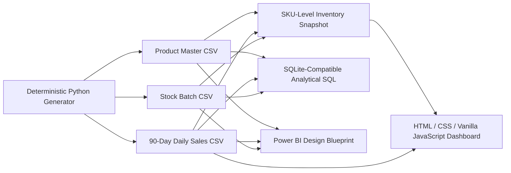

# Architecture

## Implemented analytical architecture

## Design choices

- **Normalized analytical inputs:** product, daily sales and stock-batch grains remain distinct.
- **Controlled aggregation:** sales and stock facts are aggregated before joining at SKU grain, avoiding many-to-many multiplication.
- **Derived snapshot:** a reproducible SKU-level decision table simplifies browser analytics while retaining traceability to source facts.
- **Static front end:** HTML/CSS/Vanilla JavaScript runs without a back-end service.
- **CSV source layer:** transparent, portable and easy to validate.
- **SQLite-compatible SQL:** schema and analytical queries provide a relational translation of the same business logic.
- **Power BI blueprint:** documented model/measures only; no runtime Power BI artifact is committed.
- **No secrets or production sources:** the public implementation uses synthetic files only.

## Production extension

A larger implementation could replace CSVs with governed database views and scheduled pipelines, add branch/location inventory, cost valuation, supplier lead time, open purchase orders, threshold tables, row-level security and monitored refresh.
