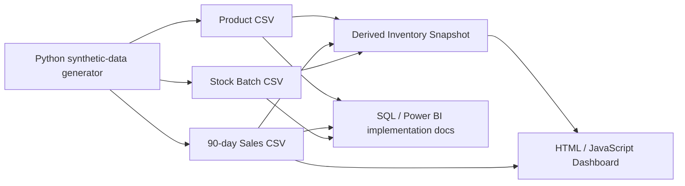

# Architecture

## Public portfolio architecture

## Design choices

- **Static front end:** easy for recruiters to run and deploy on GitHub Pages.
- **CSV sample layer:** transparent, reviewable, and tool-neutral.
- **Normalized base datasets:** demonstrate sound modeling rather than only a flat report export.
- **Derived snapshot:** makes the dashboard simple while preserving traceability to base facts.
- **No secrets/back end:** minimizes security and setup risk for a public portfolio.

## Production extension

A production implementation could replace CSV sources with governed database views, scheduled ETL/ELT, row-level security, business-owned threshold tables, and monitored refresh pipelines.
